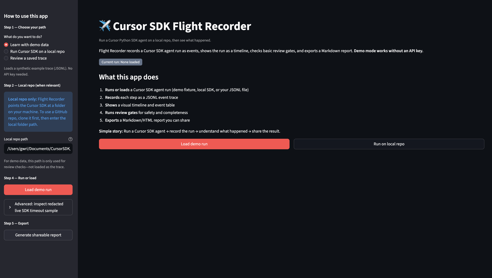
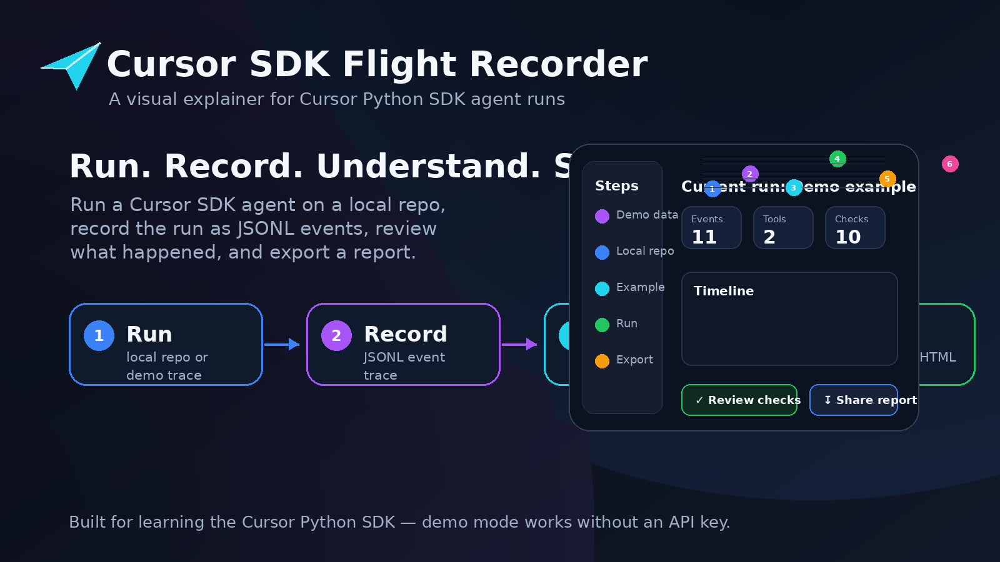
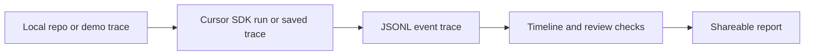
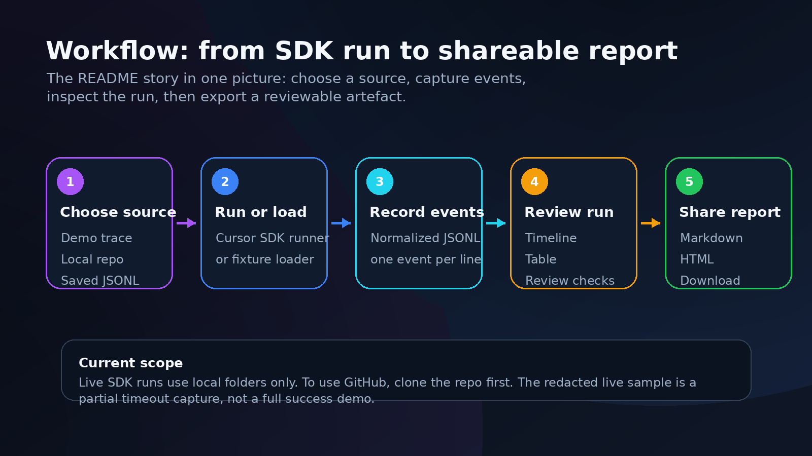
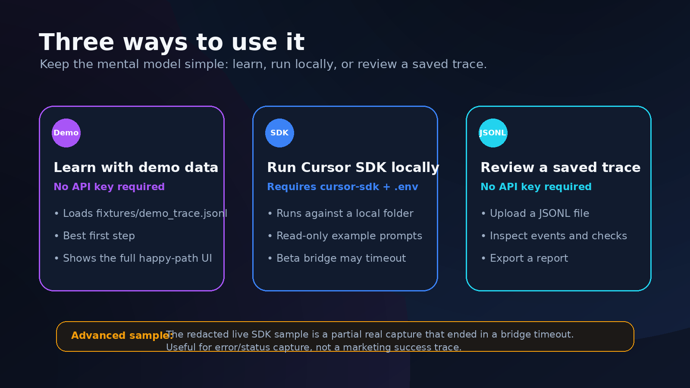
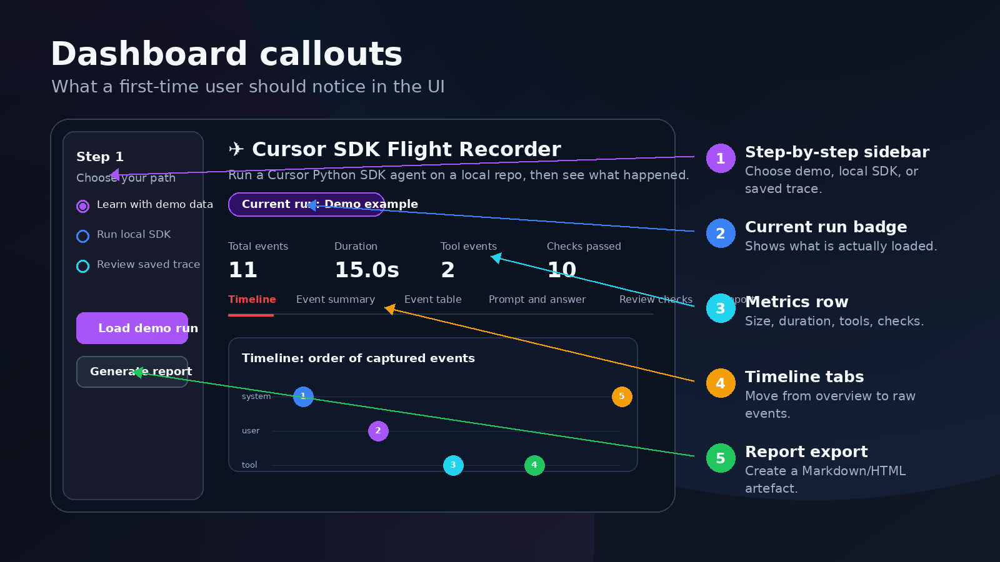

# Cursor SDK Flight Recorder

A visual explainer for [Cursor Python SDK](https://cursor.com/docs/sdk/python) agent runs.

**Run a Cursor SDK agent on a local repo, record what happened, review the trace, and export a report.**

## App screenshot



*Real app UI on first visit (onboarding + step-based sidebar). Click **Load demo run** to see the timeline, metrics, and review checks.*



*Overview graphic for the project README.*

## How it works





## What it does

Flight Recorder does five things:

1. **Runs or loads** a Cursor SDK-style agent run (demo fixture, local SDK, or your JSONL file)
2. **Records** the run as JSONL events
3. **Shows** the run as a timeline and table
4. **Runs** basic review checks (prompt present, no secret-like text, report builds, and more)
5. **Exports** a Markdown/HTML report you can share

**Simple story:** Run a Cursor SDK agent → record the run → understand what happened → share the result.

## Who it is for

- Developers learning the Cursor Python SDK
- Teams trying programmable coding agents in a small, reviewable way
- Anyone who wants a plain record of what an agent run did—not just the final answer

## Quick start

```bash
git clone https://github.com/YOUR_ORG/cursor-sdk-flight-recorder.git
cd cursor-sdk-flight-recorder
python3 -m venv .venv
source .venv/bin/activate   # Windows: .venv\Scripts\activate
pip install -e ".[dev]"
python -m pytest
streamlit run app.py
```

Open [http://localhost:8501](http://localhost:8501) and click **Load demo run**. No API key required.

Optional local SDK:

```bash
pip install -e ".[dev,sdk]"
cp .env.example .env   # add your key locally — never commit .env
```

## Three ways to use it

### Learn with demo data

- Sidebar: **Step 1 → Learn with demo data** → **Load demo run**
- Loads `fixtures/demo_trace.jsonl` (synthetic trace)
- **No API key**
- Best first step to learn the UI

### Run Cursor SDK on a local repo

- Sidebar: **Step 1 → Run Cursor SDK on a local repo**
- Set **local repo path** (folder on your machine)
- Pick a built-in example prompt or write your own
- Click **Run SDK agent**
- Requires `cursor-sdk` and credentials in `.env`

### Review a saved trace

- Sidebar: **Step 1 → Review a saved trace**
- Upload a `.jsonl` file (one JSON event per line)
- Click **Load trace**
- **No API key** needed to inspect an existing trace



## What the dashboard shows

| Area | What you see |
|------|----------------|
| **Welcome** | What the app does + **Load demo run** / **Run on local repo** |
| **Metrics** | Event count, duration, tool events, review checks passed |
| **Timeline** | Order of events during the run |
| **Event summary** | Bar or donut chart of event types |
| **Event table** | Full trace as a sortable table |
| **Prompt and answer** | What was sent and what came back |
| **Review checks** | Pass/warn/fail checklist before sharing |
| **Report** | Markdown preview + download |
| **Project self-check** | Offline scores for the demo project (not an LLM judgement) |

Sidebar is step-based: choose path → repo (if needed) → example prompt (local SDK only) → run/load → export.



## Local folders vs remote repos

**Current support:**

- **Local folders only** for live SDK runs (e.g. `examples/tiny_repo` or a path you cloned)
- **Clone GitHub repos first**, then point at the local folder
- **No direct remote GitHub URL** support in this app yet

The demo trace is a JSONL file—it does not “load” a repo into the app. The repo path is used for review checks and for live SDK runs.

## Live SDK caveats

- Cursor Python SDK is in **public beta**—event shapes may change
- Local runs need `cursor-sdk` and credentials in `.env` (never committed)
- The local bridge can **time out**; traces may be short or end in `error` status
- Built-in example prompts are **read-only** (they ask the agent not to modify files)
- This app does **not** prove a full successful live run in CI or in the committed sample below

### Advanced: redacted SDK sample

Load from the sidebar expander **Advanced: inspect redacted live SDK timeout sample**.

The committed file `fixtures/live_sample_redacted.jsonl` is a **partial real** local SDK capture that ended in a **bridge timeout** (`run_status=error`). It demonstrates safe status/error capture, **not** a full successful tool-rich agent run.

## Public safety

- No secrets in the repository
- `.env` is gitignored and never shown in the UI
- `public_safety_scan()` flags secret-like patterns before you share a trace
- Redacted live sample is safe to commit; raw live captures stay local

## Development / tests

```bash
python -m pytest -v
python -m compileall .
python scripts/ci_smoke.py
python -c "import app"
```

CI: `.github/workflows/ci.yml` (Python 3.11 and 3.13, no API key).

After publishing to GitHub, you can add:

```markdown

```

## Roadmap

- Full successful live trace capture when bridge is stable
- GitHub Actions gate summary on PRs
- Compare two runs side-by-side
- Optional remote repo wiring when the SDK supports it clearly

## License

MIT — see [LICENSE](LICENSE).
