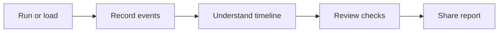
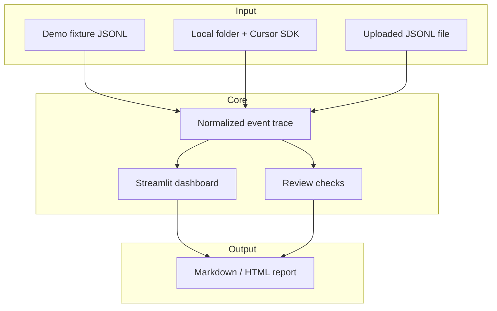
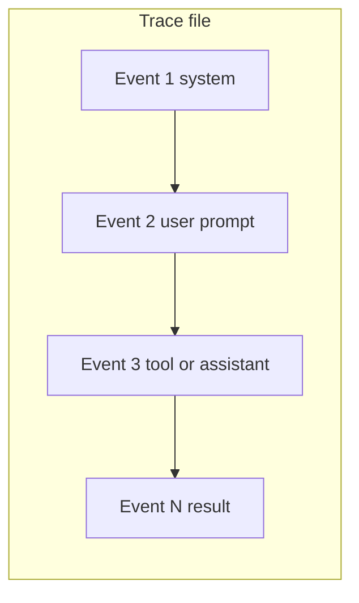
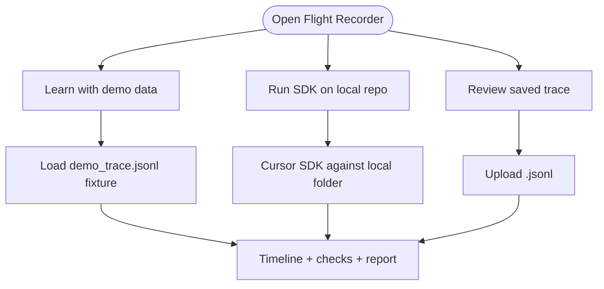
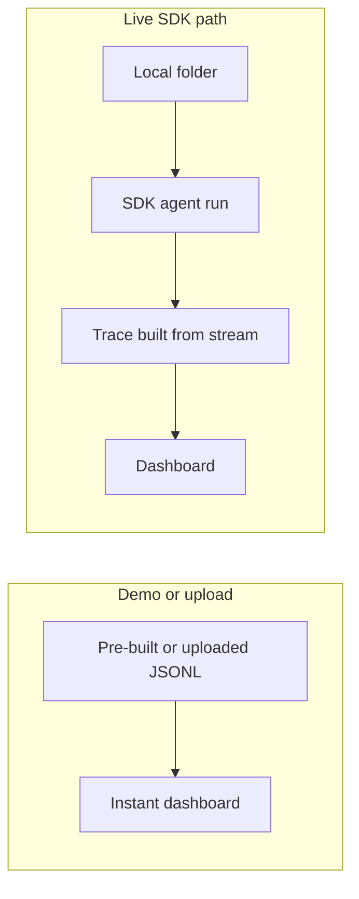
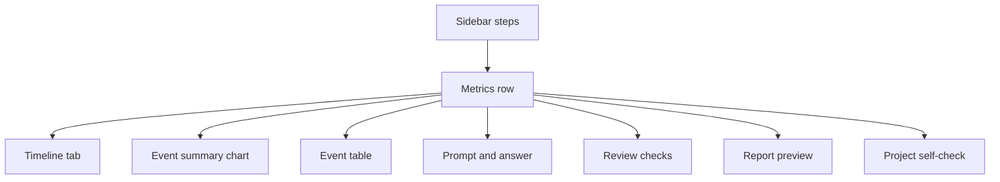
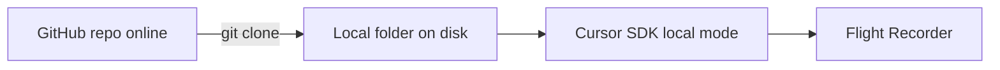
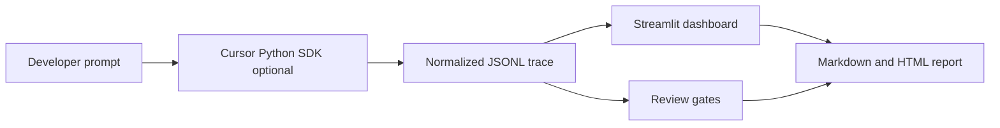
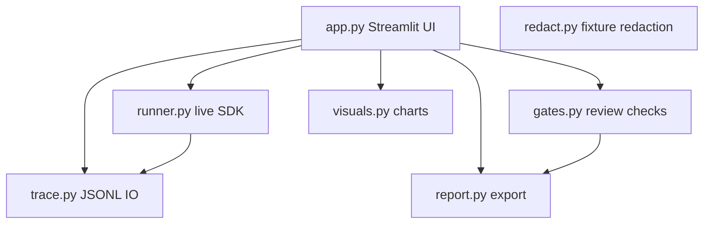

# Cursor SDK Flight Recorder

A visual explainer for [Cursor Python SDK](https://cursor.com/docs/sdk/python) agent runs.

**Run a Cursor SDK agent on a local repo, record what happened, review the trace, and export a report.**


*Real Streamlit welcome screen. Click **Load demo run** to see the metrics, timeline, event table, review checks, and report export.*

---

## Why this exists

The [Cursor Python SDK](https://cursor.com/docs/sdk/python) lets you run coding agents from Python scripts, automation, or local tools. That is powerful, but programmatic runs can feel invisible: you send a prompt, wait, and get an answer or an error—with little sense of *what happened in between*.

**Flight Recorder** makes a run easier to understand by turning it into:

- a **visible event trace** (JSONL),
- a **Streamlit dashboard** (timeline, table, charts),
- **review checks** before you share anything,
- and an **exportable report** (Markdown/HTML).

This repo is a **public-safe educational demo**. It is not a production observability platform—it is a clear place to learn how SDK runs can be recorded and reviewed.

---

## What it does

Flight Recorder does five things:

1. **Runs or loads** a Cursor SDK-style agent run (demo fixture, local SDK, or your JSONL file)
2. **Records** each step as JSONL events
3. **Shows** the run as a timeline and table
4. **Runs** basic review checks (prompt present, safety scan, report builds, and more)
5. **Exports** a Markdown/HTML report you can share

**Simple story:** Run a Cursor SDK agent → record the run → understand what happened → share the result.



| Question | Answer |
|----------|--------|
| What is this? | A small Streamlit app + Python library for inspecting SDK-style agent runs |
| Why use it? | See *how* a run unfolded, not only the final text |
| What does it load? | A **trace** (JSONL events), not opening a repo as the main action |

---

## Quick start

```bash
git clone https://github.com/GwriPennar/cursor-sdk-flight-recorder.git
cd cursor-sdk-flight-recorder
python3 -m venv .venv
source .venv/bin/activate   # Windows: .venv\Scripts\activate
pip install -e ".[dev]"
python -m pytest
streamlit run app.py
```

Open [http://localhost:8501](http://localhost:8501) and click **Load demo run**. No credentials required for demo mode.

**Optional — local Cursor SDK run:**

```bash
pip install -e ".[dev,sdk]"
cp .env.example .env   # add credentials locally — never commit .env
```

In the app: **Step 1 → Run Cursor SDK on a local repo** → set **local repo path** → **Run SDK agent**.

---

## How it works




*Optional workflow graphic (same story as the diagram above).*

**What the Cursor SDK does here (live path only):**  
When you choose **Run Cursor SDK on a local repo**, this project calls the official Python SDK (`Agent.create`, `run.messages()`, `run.wait()`), maps stream messages into a normalized trace, and displays them. Demo and upload paths **do not** call the SDK. They load existing JSONL.

---

## What is a trace?

A **trace** is a **JSONL file**: one JSON object per line, each object an **event** from a run.

Example event shape (simplified):

```json
{
  "timestamp": "2026-05-24T10:00:01+00:00",
  "type": "user",
  "role": "user",
  "summary": "User prompt received",
  "content": "Summarize this repository...",
  "status": "info",
  "metadata": {}
}
```

Common `type` values: `system`, `user`, `assistant`, `tool`, `status`, `gate`, `warning`, `error`, `self_eval`.



| File | What it is |
|------|------------|
| `fixtures/demo_trace.jsonl` | Synthetic educational trace (11 events) |
| `fixtures/live_sample_redacted.jsonl` | Partial **real** SDK capture (advanced; see caveats) |
| Your upload | Any compatible JSONL you exported elsewhere |

**Load demo run** loads a trace file. It does **not** clone or import a Git repository into the app.

---

## Three ways to use it



### 1. Learn with demo data

| Item | Detail |
|------|--------|
| **Best for** | First visit, workshops, CI, no setup |
| **Loads** | `fixtures/demo_trace.jsonl` (synthetic) |
| **Credentials** | Not required |
| **In the app** | Step 1 → **Learn with demo data** → **Load demo run** |

### 2. Run Cursor SDK on a local repo

| Item | Detail |
|------|--------|
| **Best for** | Capturing a fresh run from your machine |
| **Runs** | `cursor-sdk` against a **local directory** |
| **Credentials** | Required in `.env` (gitignored) |
| **In the app** | Step 1 → **Run Cursor SDK on a local repo** → path + example prompt → **Run SDK agent** |

Built-in example prompts are **read-only** (they ask the agent not to modify files).

### 3. Review a saved trace

| Item | Detail |
|------|--------|
| **Best for** | Inspecting a trace you already saved |
| **Loads** | Your `.jsonl` upload |
| **Credentials** | Not required |
| **In the app** | Step 1 → **Review a saved trace** → upload → **Load trace** |

### Demo vs live SDK



| Item | Demo or upload | Live SDK |
|------|----------------|----------|
| Calls Cursor SDK? | No | Yes |
| Needs credentials? | No | Yes |
| Trace source | Fixture or file | Current session |
| Guaranteed rich trace? | Demo is complete synthetic story | **No** — beta SDK, timeouts possible |

---

## What the dashboard shows

The UI is a **step-based sidebar** plus a main area with metrics, tabs, and export.



| Tab / area | What you see |
|------------|----------------|
| **Welcome** (no trace yet) | What the app does; **Load demo run** / **Run on local repo** |
| **Metrics** | Event count, duration, tool events, review checks passed |
| **Timeline** | Plotly chart: event order vs type |
| **Event summary** | Bar or donut: counts by event type |
| **Event table** | Sortable trace as a dataframe |
| **Prompt and answer** | Input text and final assistant output |
| **Review checks** | Pass / warn / fail gate cards + matrix |
| **Report** | Markdown preview + download |
| **Project self-check** | Deterministic scores (not an LLM judgement) |

**Advanced (sidebar expander):** **Redacted live SDK timeout sample** — partial real capture for studying `status` / `error` events (see caveats).

---

## Local folders vs remote repos

**Current support:**

| Supported | Not supported yet |
|-----------|-------------------|
| Local folder path (e.g. `examples/tiny_repo`) | Remote GitHub URL in the app |
| Clone a repo, then point at the clone | Direct run against github.com org repo URL |
| Demo JSONL trace (no repo needed to view) | Multi-run comparison UI |



**Repo path in the app** is used for:

- **Review checks** (e.g. does the folder exist?),
- **Live SDK runs** (SDK `cwd`),

- not as a substitute for loading a trace when you use demo data.

---

## Live SDK caveats

Be precise about what this repo proves:

- Cursor Python SDK is in **public beta** — event shapes may change.
- Live mode needs the **`cursor-sdk`** package and **local credentials** in `.env` (never committed).
- The local **bridge can time out**; traces may be short or end with `error` status.
- This project does **not** demonstrate a guaranteed **full successful** live run in CI or in the committed redacted sample.
- Built-in prompts are read-only; the app does not enforce read-only at the SDK level.

### Redacted SDK sample (partial capture)

Under **Advanced → inspect redacted live SDK timeout sample**:

`fixtures/live_sample_redacted.jsonl` is a **partial real** local SDK capture that ended in a **bridge timeout** (`run_status=error`). It shows that status/error events can be recorded safely after redaction. It is **not** a full successful tool-rich agent run.

---

## Public safety

- No secrets in the repository.
- `.env` is gitignored; the UI never displays credential files.
- `public_safety_scan()` flags secret-like patterns in trace text before sharing.
- Redacted live sample is safe to commit; raw live captures stay local (`fixtures/_live_raw_temp.jsonl` is gitignored).

---

## Development / tests

```bash
python -m pytest -v
python -m compileall .
python scripts/ci_smoke.py
python -c "import app"
```

[](https://github.com/GwriPennar/cursor-sdk-flight-recorder/actions/workflows/ci.yml)

GitHub Actions (`.github/workflows/ci.yml`): Python 3.11 and 3.13, `pytest`, `compileall`, report smoke, app import — **no live SDK credentials in CI**.

| Check | Command |
|-------|---------|
| Unit tests | `python -m pytest -v` |
| Bytecode | `python -m compileall .` |
| Fixture smoke | `python scripts/ci_smoke.py` |
| App import | `python -c "import app"` |
| Dashboard | `streamlit run app.py` |

---

## Mermaid architecture reference

Editable diagrams for maintainers (also rendered on GitHub):

**End-to-end pipeline:**



**Module map:**



---

## Extra visuals

<details>
<summary><strong>Generated overview images (click to expand)</strong></summary>


*Overview graphic.*


*Three usage paths (illustration).*


*Dashboard areas (illustration).*

</details>

---

## Roadmap

- Reliable **full** live trace capture when the local bridge is stable
- GitHub Actions gate summary on pull requests
- Compare two runs side-by-side
- Clearer remote-repo story if/when the SDK and this app support it explicitly

---

## License

MIT — see [LICENSE](LICENSE).
