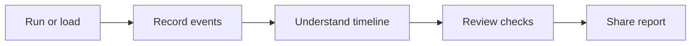
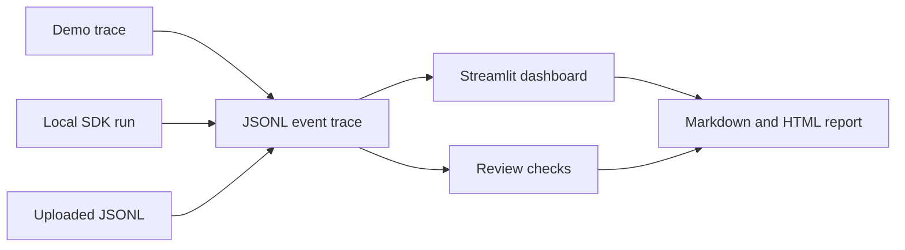

# Cursor SDK Flight Recorder

A visual explainer for [Cursor Python SDK](https://cursor.com/docs/sdk/python) agent runs.

**Run a Cursor SDK agent on a local repo, record what happened, review the trace, and export a report.**


*Real app UI on first visit. Click **Load demo run** to see the timeline, metrics, event table, review checks, and report export.*

## Why this exists

The Cursor Python SDK lets developers run coding agents from Python scripts, automation, or local tools.

That is powerful, but programmatic agent runs can feel invisible: you send a prompt, wait, and get an answer or an error. Flight Recorder makes the run easier to understand by turning it into a visible event trace, review checks, and a shareable report.

This repo is a public-safe educational demo. It is not a production observability platform.

## What it does

Flight Recorder does five things:

1. Runs or loads a Cursor SDK-style agent run.
2. Records the run as JSONL events.
3. Shows the run as a timeline and table.
4. Runs basic review checks.
5. Exports a Markdown/HTML report.



## Quick start

```bash
git clone https://github.com/GwriPennar/cursor-sdk-flight-recorder.git
cd cursor-sdk-flight-recorder
python3 -m venv .venv
source .venv/bin/activate
pip install -e ".[dev]"
python -m pytest
streamlit run app.py
```

Open [http://localhost:8501](http://localhost:8501) and click **Load demo run**. No API key is required.

Optional local SDK mode:

```bash
pip install -e ".[dev,sdk]"
cp .env.example .env
```

Add your Cursor key to `.env` locally. Never commit `.env`.

## How it works



The dashboard is not a replacement for Cursor. It is a small visual layer that helps you inspect a run after it happens.

## What is a trace?

A trace is a JSONL file: one JSON object per line. Each object is an event from a run.

Example event:

```json
{
  "timestamp": "2026-05-24T10:00:01+00:00",
  "type": "user",
  "role": "user",
  "summary": "User prompt received",
  "content": "Summarize this repository.",
  "status": "info",
  "metadata": {}
}
```

Common event types include `system`, `user`, `assistant`, `tool`, `status`, `gate`, `warning`, `error`, and `self_eval`.

## Three ways to use it

| Path | API key? | What happens | Best for |
|------|----------|--------------|----------|
| Learn with demo data | No | Loads `fixtures/demo_trace.jsonl` | First-time users |
| Run Cursor SDK on a local repo | Yes | Runs the SDK against a local folder | Local SDK experiments |
| Review a saved trace | No | Uploads a JSONL trace | Inspecting previous runs |

## What the dashboard shows

| Area | What you see |
|------|--------------|
| Welcome | What the app does and how to start |
| Metrics | Event count, duration, tool events, review checks passed |
| Timeline | Order of events during the run |
| Event summary | Bar or donut chart of event types |
| Event table | Full trace as a sortable table |
| Prompt and answer | What was sent and what came back |
| Review checks | Pass, warn, and fail checklist before sharing |
| Report | Markdown preview and download |
| Project self-check | Offline scores for the demo project, not an LLM judgement |

## Local folders vs remote repos

Current support:

- Local folders only for live SDK runs.
- To use a GitHub repo, clone it first, then point Flight Recorder at the local folder.
- Direct remote GitHub URL support is not implemented yet.

```bash
git clone https://github.com/example/project.git
# Then point Flight Recorder at ./project
```

## Live SDK caveats

Be precise about what this repo proves:

- Cursor Python SDK is in public beta; event shapes may change.
- Live mode needs the `cursor-sdk` package and local credentials in `.env`.
- The local bridge can time out; traces may be short or end with `error` status.
- Built-in prompts are read-only, but the app does not enforce read-only at the SDK level.
- This project does not demonstrate a guaranteed full successful live run in CI.

The committed file `fixtures/live_sample_redacted.jsonl` is a partial real local SDK capture that ended in a bridge timeout (`run_status=error`). It demonstrates safe status/error capture, not a full successful tool-rich agent run.

## Public safety

- No secrets are committed.
- `.env` is gitignored.
- The UI never displays credential files.
- `public_safety_scan()` flags secret-like patterns in trace text before sharing.
- Raw live captures should stay local.

## Development and tests

```bash
python -m pytest -v
python -m compileall .
python scripts/ci_smoke.py
python -c "import app"
```

CI workflow: `.github/workflows/ci.yml`.

## Roadmap

- Reliable full live trace capture when the local bridge is stable.
- GitHub Actions gate summary on pull requests.
- Compare two runs side-by-side.
- Clearer remote-repo story if and when this app supports it explicitly.
- Better HTML report rendering.

## License

MIT — see [LICENSE](LICENSE).
