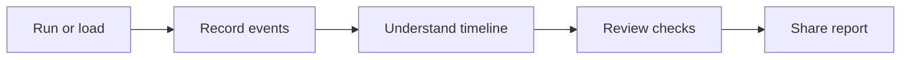
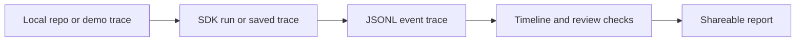

# Cursor SDK Flight Recorder

A visual explainer for [Cursor Python SDK](https://cursor.com/docs/sdk/python) agent runs.

**Run a Cursor SDK agent on a local repo, record what happened, review the trace, and export a report.**

Run `streamlit run app.py` and click **Load demo run** to explore the welcome screen, timeline, event table, review checks, and report export. Diagrams below use Mermaid only (no README image embeds).

## Why this exists

The Cursor Python SDK lets developers run coding agents from Python scripts, automation, or local tools.

That is powerful, but programmatic agent runs can feel invisible: you send a prompt, wait, and get an answer or an error. Flight Recorder makes the run easier to understand by turning it into a visible event trace, review checks, and a shareable report.

This repo is a public-safe educational demo. It is not a production observability platform.

## What it does

Flight Recorder does five things:

1. Runs or loads a Cursor SDK-style agent run.
2. Records each step as JSONL events.
3. Shows the run as a timeline and table.
4. Runs basic review checks.
5. Exports a Markdown/HTML report.

**Simple story:** Run a Cursor SDK agent, record the run, understand what happened, share the result.



## Quick start

```bash
git clone https://github.com/GwriPennar/cursor-sdk-flight-recorder.git
cd cursor-sdk-flight-recorder
python3 -m venv .venv
source .venv/bin/activate
pip install -e ".[dev]"
python -m pytest
streamlit run app.py
```

Open http://localhost:8501 and click **Load demo run**. No credentials required for demo mode.

Optional local SDK:

```bash
pip install -e ".[dev,sdk]"
cp .env.example .env
```

Add credentials locally in `.env` only. Never commit `.env`.

## Three ways to use it

### Learn with demo data

- Sidebar: Step 1, **Learn with demo data**, then **Load demo run**
- Loads `fixtures/demo_trace.jsonl` (synthetic trace)
- No credentials required
- Best first step

### Run Cursor SDK on a local repo

- Sidebar: Step 1, **Run Cursor SDK on a local repo**
- Set **local repo path** (folder on your machine)
- Pick a built-in example prompt or custom text
- Click **Run SDK agent**
- Requires `cursor-sdk` and local credentials in `.env`

### Review a saved trace

- Sidebar: Step 1, **Review a saved trace**
- Upload a `.jsonl` file (one JSON event per line)
- Click **Load trace**
- No credentials required

## What is a trace?

A trace is a JSONL file: one JSON object per line. Each object is an event (user prompt, tool action, assistant text, status, and so on).

**Load demo run** loads a trace file. It does not clone or import a Git repository into the app.

## What the dashboard shows

| Area | What you see |
|------|----------------|
| Welcome | Onboarding and **Load demo run** |
| Metrics | Event count, duration, tool events, review checks passed |
| Timeline | Order of events during the run |
| Event summary | Chart of event types |
| Event table | Full trace as a table |
| Prompt and answer | Input and final output |
| Review checks | Pass, warn, or fail checklist |
| Report | Markdown preview and download |

Sidebar flow: choose path, repo if needed, example prompt for live SDK, run or load, export.

## Local folders vs remote repos

**Current support:**

- Local folder paths only for live SDK runs (for example `examples/tiny_repo`)
- Clone GitHub repos first, then point at the local folder
- No direct remote GitHub URL support in this app yet

The repo path is used for review checks and for live SDK `cwd`. It is not a substitute for loading demo trace data.

## Live SDK caveats

- Cursor Python SDK is in public beta. Event shapes may change.
- Live mode needs `cursor-sdk` and local credentials in `.env` (never committed).
- The local bridge can time out. Traces may be short or end with `error` status.
- This project does **not** demonstrate a guaranteed full successful live run in CI or in the committed sample below.
- Built-in example prompts are read-only style. The app does not enforce read-only at the SDK level.

### Advanced: redacted SDK sample

Load from the sidebar expander **Advanced: inspect redacted live SDK timeout sample**.

`fixtures/live_sample_redacted.jsonl` is a partial real local SDK capture that ended in a bridge timeout (`run_status=error`). It demonstrates safe status and error capture after redaction. It is **not** a full successful tool-rich agent run.

## Public safety

- No secrets in the repository
- `.env` is gitignored. The UI never displays credential files
- `public_safety_scan()` flags secret-like patterns in trace text
- Redacted live sample is safe to commit. Raw live captures stay local

## Development and tests

```bash
python -m pytest -v
python -m compileall .
python scripts/ci_smoke.py
python -c "import app"
```

[](https://github.com/GwriPennar/cursor-sdk-flight-recorder/actions/workflows/ci.yml)

CI uses Python 3.11 and 3.13. No live SDK credentials in CI.

## How it works (overview)



## Roadmap

- Reliable full live trace capture when the local bridge is stable
- GitHub Actions gate summary on pull requests
- Compare two runs side by side
- Clearer remote repo support if the SDK and this app add it later

## License

MIT. See [LICENSE](LICENSE).
